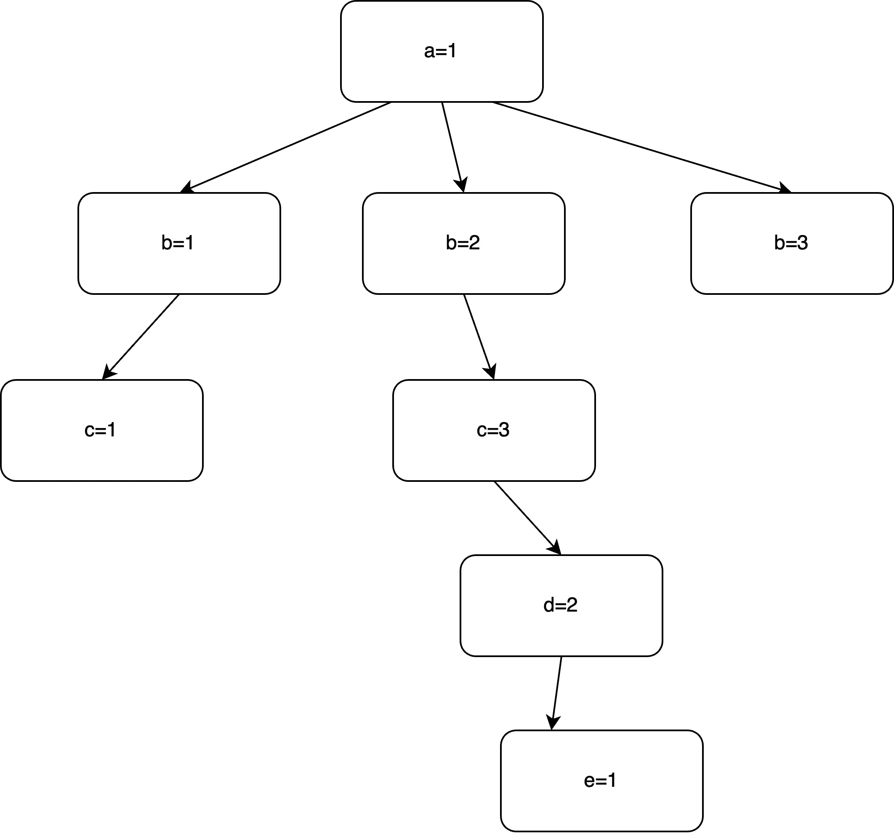

解答该图的**m=3着色问题**的回溯法步骤如下：

**(1) 解向量的形式与解空间树的类型**

• **解向量的形式**：

设图中共有 个顶点，分别为 ， 表示有 3 种颜色可供选择。

解向量表示为：  

$$
X = (x_1, x_2, x_3, x_4, x_5)
$$

$$
其中 x_i表示第i 个顶点的颜色，且 X_i \in{1,2,3} 。
$$

• **解空间树的类型**：

• 解空间树为**m叉树**，因为每个顶点的颜色都有 3个可选分支。

• 需要满足**相邻顶点颜色不同**的约束条件。  

**(2) 搜索过程描述**
**回溯搜索步骤如下：**

1. **初始化**：

$$
顶点a,b,c,d,e 按顺序选择颜色。初始解向量为X=(0,0,0,0,0) 。
$$

2. **约束检查**：

对每个顶点尝试分配颜色 {1,2,3}，分配时检查当前顶点与已分配顶点的相邻情况，确保相邻顶点颜色不同。

3. **逐步扩展**：

$$
从根节点开始，对 X_1 分配颜色，然后对 X_2分配颜色，以此类推。
$$

$$
如果在某个顶点无法分配颜色，进行回溯，退回上一个顶点并尝试下一个颜色。
$$

4. **成功终止**：

当所有顶点都分配了颜色，且满足相邻顶点颜色不同时，搜索成功，得到一个解。

  

**(3) 搜索树与解**

  

**搜索树生成部分**

在搜索过程中，部分搜索树节点如下：

$$
（假设顺序为a,b,c,d,e ，颜色集合为 {1,2,3}）
$$

$$
1. a=1：分配顶点1 颜色1 。
$$

$$
2.b=2 ：顶点b 与a 相邻，因此选择颜色 2。
$$

$$
3. c=3：顶点 c与 ,a,b 相邻，选择颜色 3。
$$

$$
4. d=2：顶点d 与c 相邻，选择颜色2 。
$$

$$
5. e=1：顶点e 与 ,c,d 相邻，选择颜色 1。
$$

最终解为：

$$
X=(1,2,3,2,1)
$$
  

**部分搜索树**

搜索树的部分示意图如下：

  

  

**