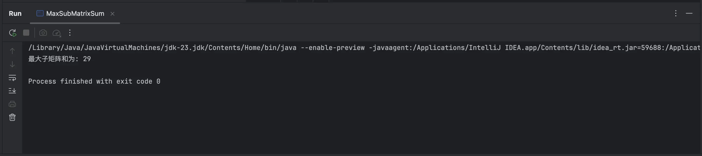
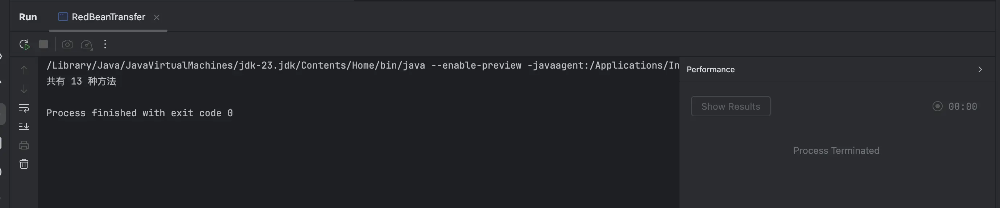
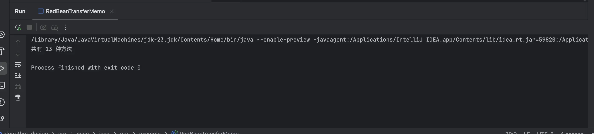

软件2203 陈林涛 2223515367

**1. 最大子矩阵和问题（动态规划）**


给定一个 m * n 的二维矩阵，要求计算最大的子矩阵和。这个问题是经典的二维动态规划问题，通常使用 Kadane’s Algorithm 来解决一维的最大子数组和，然后扩展到二维。

  

**思路**：

• 使用 Kadane’s 算法将问题从二维矩阵转化为多个一维问题。

• 遍历每一对行 [i, j]，将从行 i 到行 j 的每列求和，得到一个临时数组 sum[]，然后使用 Kadane’s 算法找到这个一维数组的最大和。

  

**代码实现：**

```java
  

public class MaxSubMatrixSum {


    public static int maxSum(int[][] matrix) {

        int m = matrix.length;

        int n = matrix[0].length;

  

        int maxSum = Integer.MIN_VALUE;


        for (int startRow = 0; startRow < m; startRow++) {

            int[] temp = new int[n];  
  
            for (int endRow = startRow; endRow < m; endRow++) {

                for (int col = 0; col < n; col++) {

                    temp[col] += matrix[endRow][col];

                }


                int currentMax = kadane(temp);

                maxSum = Math.max(maxSum, currentMax);

            }

        }

        return maxSum;

    }

  

    private static int kadane(int[] arr) {

        int maxSum = arr[0];

        int currentMax = arr[0];

  

        for (int i = 1; i < arr.length; i++) {

            currentMax = Math.max(arr[i], currentMax + arr[i]);

            maxSum = Math.max(maxSum, currentMax);

        }

        return maxSum;

    }

  
    public static void main(String[] args) {

        int[][] matrix = {

            {1, 2, -1, -4, -20},

            {-8, -3, 4, 2, 1},

            {3, 8, 10, 1, 3},

            {-4, -1, 1, 7, -6}

        };

  

        System.out.println("最大子矩阵和为: " + maxSum(matrix));

    }

}
  
```

**解释**：

• 我们通过两层循环选择子矩阵的上下边界 startRow 和 endRow，并在每次选择的子矩阵范围内，通过累加每列的元素得到 temp[] 数组。

• 然后，使用 Kadane’s 算法来计算一维数组 temp[] 的最大子数组和，最终得到最大子矩阵和。

**执行结果**



**2. 红豆转移问题（递推法和备忘录法）**

  

在这个问题中，我们要求解共有多少种方法将 n 粒红豆从 A 碗转移到 B 碗，每次可以转移 1、2 或 3 粒红豆。


**2.1 递推法（迭代法）**


递推法的思想是通过动态规划的方式，从小的子问题逐步构建到解决原问题。对于每个状态 n，可以从 n-1、n-2、n-3 转移过来，因此状态转移方程为：


dp[n] = dp[n-1] + dp[n-2] + dp[n-3]

  

初始条件是：

• dp[0] = 1 （从 A 碗转移 0 粒红豆，只有 1 种方法）

• dp[1] = 1 （从 A 碗转移 1 粒红豆，只有 1 种方法）

• dp[2] = 2 （从 A 碗转移 2 粒红豆，有 2 种方法：1+1 或 2）


**代码实现（递推法）：**

  
```java

public class RedBeanTransfer {

    public static int transferWays(int n) {

        if (n == 0) return 1;  // 0粒红豆只有1种方法

        if (n == 1) return 1;  // 1粒红豆只有1种方法

        if (n == 2) return 2;  // 2粒红豆有2种方法

        int[] dp = new int[n + 1];

        dp[0] = 1;

        dp[1] = 1;

        dp[2] = 2;

  
        for (int i = 3; i <= n; i++) {

            dp[i] = dp[i - 1] + dp[i - 2] + dp[i - 3];

        }

  

        return dp[n];

    }


    public static void main(String[] args) {

        int n = 5;  

        System.out.println("共有 " + transferWays(n) + " 种方法");

    }

}

  
```

**解释**：

• dp[i] 表示转移 i 粒红豆的不同方法数。通过递推计算出每一个状态，直到 n 粒红豆。

**执行结果**：
- 
  
**2.2 备忘录法（递归 + 缓存）**


备忘录法的思想是用一个数组记录已经计算过的结果，避免重复计算，从而提高效率。递归的基本思路与递推法相同。

**代码实现（备忘录法）：**

```java
  

public class RedBeanTransferMemo {


    public static int transferWays(int n) {

        int[] memo = new int[n + 1];

        return transferWaysMemo(n, memo);

    }


    private static int transferWaysMemo(int n, int[] memo) {

        if (n == 0) return 1;

        if (n == 1) return 1;

        if (n == 2) return 2;

  

        if (memo[n] != 0) {

            return memo[n];  

        }


        memo[n] = transferWaysMemo(n - 1, memo) + transferWaysMemo(n - 2, memo) + transferWaysMemo(n - 3, memo);

        return memo[n];

    }

  
    public static void main(String[] args) {

        int n = 5;  // 示例

        System.out.println("共有 " + transferWays(n) + " 种方法");

    }

}

  

```
**解释**：

• 递归方法通过 transferWaysMemo() 递归计算结果，并利用 memo[] 数组缓存已经计算过的结果，避免重复计算，提高效率。

**执行结果**

- 
