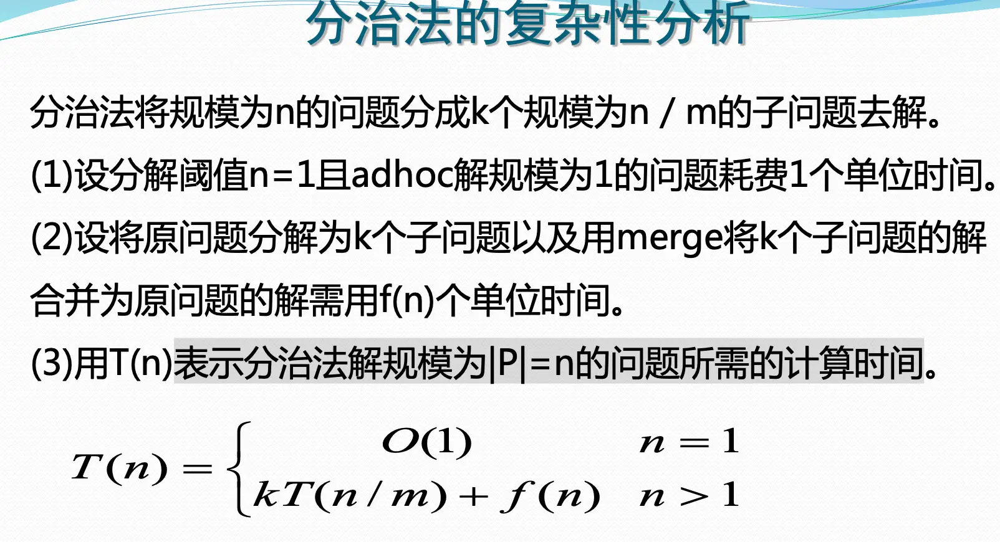
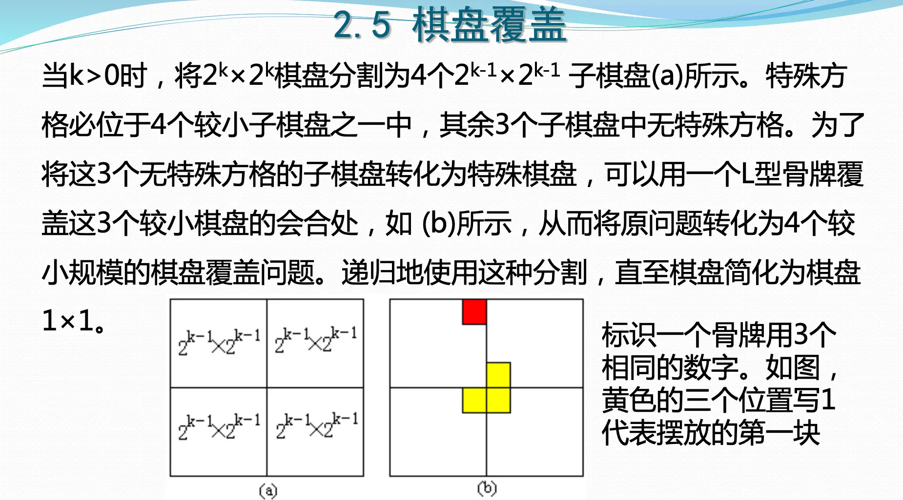
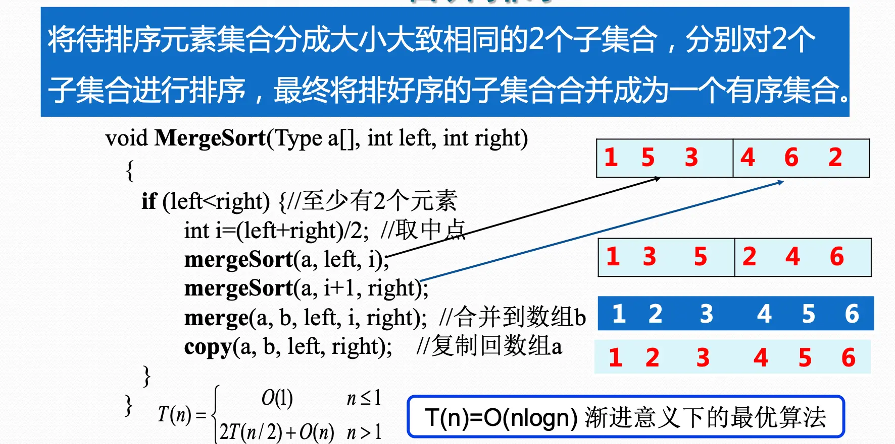

### 分治法思想

- 分+治+合
- 设计思想：将一个难以直接解决的大问题, 分割成一些规模较小的相同问题，以便各个击破，分而治之。
- 分治法解决问题通常使用**递归算法**
分治算法的核心思想就是「分而治之」。

大概的流程可以分为三步：分解 -> 解决 -> 合并。

1. 分解原问题为结构相同的子问题。
2. 分解到某个容易求解的边界之后，进行递归求解。
3. 将子问题的解合并成原问题的解。

分治法能解决的问题一般有如下特征：

- 该问题的规模缩小到一定的程度就可以容易地解决。
- 该问题可以分解为若干个规模较小的相同问题，==**即该问题具有最优子结构性质**==，利用该问题分解出的子问题的解可以合并为该问题的解。
- 该问题所分解出的各个子问题是相互独立的，即子问题之间不包含公共的子问题。


递归是一种编程技巧，一种解决问题的思维方式；分治算法很大程度上是基于递归的，解决更具体问题的算法思想。





### 二分查找法


### 快速幂算法

1、使用递归思想
$$对于a^n，当n为偶数时：a^n=(a^2)^{\frac{n}{2}}，当n为奇数时：a^n=(a^2)^{\frac{n}{2}} \times a$$
代码如下：
```python
def binpow(a, b):
if b == 0: return 1
res = binpow(a, b // 2)
if (b % 2) == 1:
return res * res * a
else: return res * res
```


2、使用二进制幂方法
可以将n拆解成二进制数，对于某一位的二进制数为1，即该位需要进行乘幂
对n向右逐位检查，同时更新权重a


代码如下：
```python
def binpow(a,b):
	if a=0: return 0
	if b=0: return 1
	while b>0:
			if b&1:
				res=res*a
			a=a*a
			b>>=1
	
```


### Strassen 矩阵乘法


### 棋盘覆盖




### 归并排序



