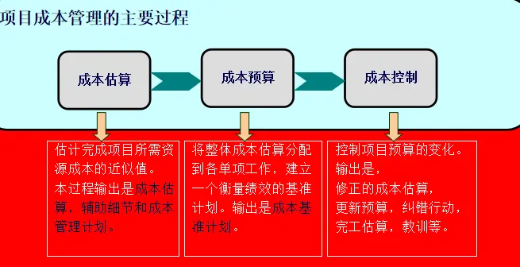
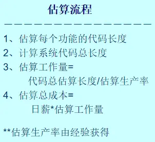

### 项目成本管理的概念：
- 概念
	- 项目成本管理包括确保**在批准的预算范围内完成项目所需的各个过程**

### 项目成本管理的主要过程：

#### 计划成本管理

- 概念
	- 用于于计划、执行、控制项目成本的政策、程序和文档
#### 成本估算：
##### 概念
- 概念：所要完成项目各项活动的说需要的资源进行估算，预估整个项目所需的资源成本
- **全寿命期成本**：包括开发、运行、维护、处置的成本。全寿命期成本也称做**总拥有成本**
##### 成本估算的类型
- 粗数量级估算
	- 时间
		- 项目的概念或启动阶段
	- 作用
		- 为项目选择决策提供成本估算
- 预算估算（类比估算，自上而下）
	- 时间
		- 项目计划阶段，在WBS制定之前
	- 作用
		- 将资金拨入项目预算
- 确定性估算（详细估算，自下而上）
	- 时间
		- 项目计划阶段，WBS制定之后
	- 作用
		- 为采购提供详细，实际估算

##### 成本估算过程的**输出**：
- 成本估算
- 支持细节
- 成本管理计划

- LOC估算法一种从技术的角度来估算软件成本的方法的总称，代表的方法有：
    - PERT估算法
    - 类比估算法
    - DELPHI估算法

##### 成本估算的技术
- 类比估算
- 自下而上
- 参数模型估计
- 计算机工具
==功能点分析理论==
功能点方法能够从用户角度测量交付给最终用户的产品功能规模，并且利用这一规模更有效地估计产品成本

#### 成本预算

- 将整体成本预算分配到各个工作，输出成本基准计划

#### 成本控制
##### **挣值分析**
- 概念
	- 挣值分析是一种**项目绩效衡量技术**，它综合了**范围，时间和成本数据**。它对**计划完成的工作**，**实际挣得的收益**，**实际花费的成本**进行比较，以确定**成本与进度是否按计划进行**。

	- 在挣值分析中主要是以**金钱**的方式对偏差进行分析

 ##### **3222原则**：
 
- 三个关键中间变量
$$
PV （计划成本）=到该进度的计划成本
$$

$$
AC（实际成本）=活动到该进度的实际花费
$$

$$
EV（挣值：已完成的工作预算成本）= 各活动的预算成本\times 完成率
$$
- 两个差异分析变量
$$
CV（成本偏差）=Ev-AC

$$

$$
SV（进度偏差）=EV-PV
$$

- 两个指数变量
$$
CPI（成本完成指数）=\frac{EV}{AC}     大于1有利小于1不利
$$

$$
SPI（进度完成指数）=\frac{EV}{PV}. 大于1有利小于1不利
$$

- 两个预测变量 
$$
预计完工总成本=\frac{计划总成本}{CPI}
$$

$$
预计总时间=\frac{计划时间}{SPI}
$$

