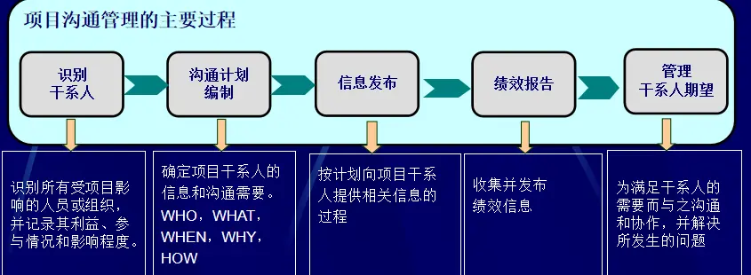
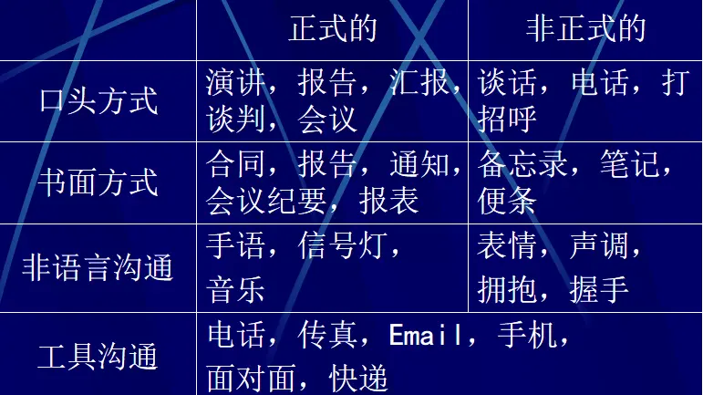

## 项目沟通管理
### 沟通

- 概念
	- 人与人之间的思想和信息的交换
	- 沟通是管理的本质
	- 管理离不开沟通

### 项目沟通管理

#### 概念

- 在项目生命周期，通过适当和及时地生成、采集、储存、处理和发布有关的项目信息，确保项目干系人能够在正确的时间，正确的地点，以正确的方式获得正确的 信息 的管理过程和活动。

#### 项目经理的角色
- ==中心角色==
- 需要控制沟通，但又不能控制所有的信息
- 需要掌握与不同人的沟通技巧
- 及时发现沟通障碍病清除

#### 项目沟通管理的过程

- 目标
	- 及时适当的创建，收集，发送，存储和处理项目信息
- 沟通基本准则：
	- 准确性原则
	- 完整性原则
	- 及时性原则
	- 运用非正式组织沟通的原则
##### 主要过程：
-  

###### 1.识别干系人
- 方法：
	- 干系人分析
	- 专家判断

###### 2.沟通计划编排

- 概念：对项目全过程的沟通工作、沟通方法，沟通渠道等各个方面的计划和安排

- 要求：在项目进行过程中定期检查，不断调整补充

###### 3.信息发布
- 概念：项目干系人定期收到所需要的信息的过程
-  沟通渠道
	- 概念：沟通渠道看起来像联系所有参与者的电话线的数目
	- 理论公式：$Num=\frac{N(N-1)}{2}$
	- 发布方法：
		- 口头
		- 书面
		- 非语言沟通
		- 工具
	- 
- 沟通方法
	- 互动沟通
	- 推送沟通
	- 拉式沟通

###### 4.绩效报告

- 组成
	- 状态报告：项目在某一时间点所处的位置
	- 进展报告：项目在特定时间周期内完成的工作
	- 预测：预测项目进度状态
- 三种形式
	- 定期项目报告
	- 阶段审查
	- 紧急报告
- 重要方法
	- 状态评审会议

###### 5.干系人期望

- 概念：管理干系人期望是为满足干系人的需要而与之沟通和协作，并解决所发生问题的过程
- 改善沟通的建议
	- 尽早沟通
	- 主动沟通
- 在面对面的沟通中，大多数信息是**通过肢体语言**传递的

